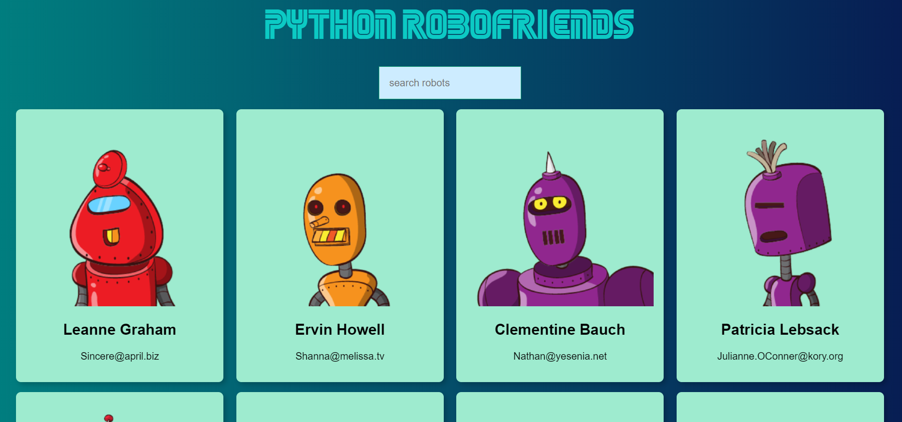
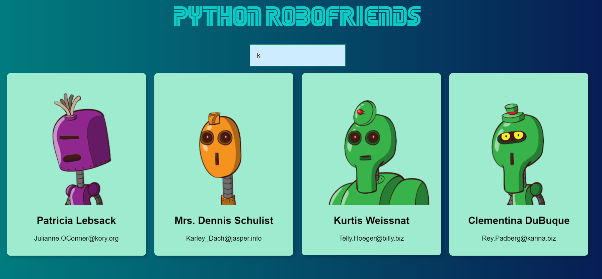
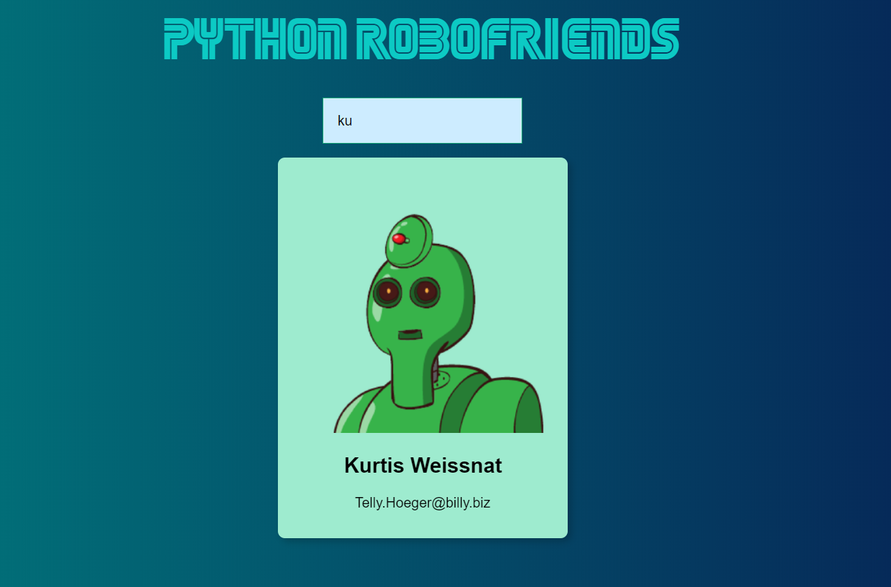

Python Robofriends
==================

This repo is just a POC for converting a native javascript application to python

Installation
------------

This project is leveraging poetry. You should download and install poetry based on the offical `install guide
<https://python-poetry.org/docs/#introduction>`_ from poetry.

``
cd working_dir
git clone https://github.com/LongBeachHXC/pythonRobofriends.git
cd pythonRobofriends
poetry install
``

Usage
-----

Once you have the project installed via poetry, activate the server with the following:

``
poetry run uvicorn main:app
``

The server will be active on ``http://127.0.0.1:8000``

Copy and paste the address into your browser bar and it should take you to the Python Robofriends website.

From here you can search for a specific user

Authors
-------

[Forrest Weinberg](mailto:fweinberg@live.com) ([@LongBeachHXC](https://github.com/LongBeachHXC))

Versioning
----------
Initial release 1.0.0 - 02/26/2020